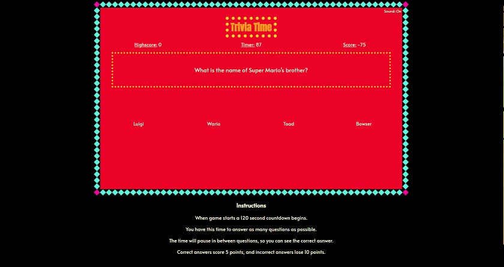

# Trivia Game

## Description
The purpose of this project is to practice, showcase, and enhance my HTML/CSS/.JS skills. 
The goal is to build a visually pleasing in-browser trivia game.

## Approach
The interface is created using a blend of HTML, CSS, and JavaScript. Timing and operation is all controlled through JavaScript. Questions are stored in an external .json file, within the file is a list of arrays. Each question is on arrary formated: [Question, Option A, Option B, Option C, Option, 0-3].
The final index (0-3) instructs the JavaScript which option is the correct answer--i.e. 0=A, 1=B etc. When the gametimer reaches 0, or the final question is answered the game enters it's endstate, logging a highscore and presenting the player with stats. The different gamestates--start screen, gameplay screen, and endgame screen--are reprented by separte DIVs in the main HTML body that are toggled between block and none display appropriately.

## Screenshot

## Features

#### Bronze (implemented)
- Simple text based trivia
- boxes to click on on to display answers.
- right or wrong displayed in console.

#### Silver (implemented)
- Has reset button at end of game.
- Text based trivia
- Keeps track and displays score of 1 pt. for correct questions.
- Shows right or wrong in game box before continuing.
- Keeps track of highscore between games.
- Keeps track of score.

#### Gold

##### To Be Implemented

- Create questions that display images.

##### Implemented
- Create start splash.
- Play sound on correct/incorrect.
- Timer sound to each tick.
- Sound Toggle button.
- Visually pleasing and reads easily.
- Pulls questions from a separate source file and choose from them randomly.
- Game subscreen shows your answer and the correct answer.
- Game final screen shows summary with stats and reset button.
- Scores 5 points per questions correct, or -10 incorrect.
- Runs game timer that ends game at 0, or at end of question list.

## Tech Used
- JavaScript
- CSS
- HTML